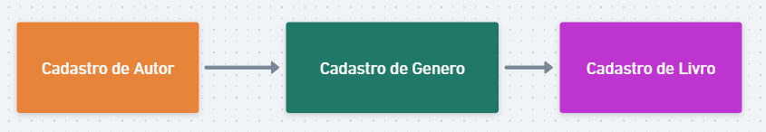

# API para cadastro de livros 

Api para teste de alunos fazerem post, get, put e delete de 3 entidades:

livros
autores
generos


API PARA CADASTRO DE LIVROS, COM O FLUXO:



Estrutura dos dados:


Livro:


id
integer
title: ID
readOnly: true
title*
string
title: Nome do livro
maxLength: 100
minLength: 1
description*
string
title: Descrição do livro
minLength: 1
author*
integer
title: Author
gender*
integer
title: Gender
 


}


Autor e gênero:
{
id
integer
title: ID
readOnly: true
name*
string
title: Name
maxLength: 50
minLength: 1
 


}


Endpoints:

POST E GET:

	/books/
	/genders/
	/authors/

PUT, DELETE E GET:

	/books/ID
	/genders/ID
	/authors/ID

Swagger da aplicação:

	/swagger


## Requisitos

- Python 3.8 ou superior
- Django 4.2
- MySQL

## Instalação

Siga os passos abaixo para configurar o ambiente de desenvolvimento local:

### Clone o Repositório

Clone o repositório para sua máquina local usando:

```bash
git clone REPO .  

```

### Configurar o ambiente

```bash
python3 -m venv myenv
source myenv/bin/activate  # No Windows use `myenv\Scripts\activate` 
```

### Instalar Dependências

```bash
pip install -r requirements.txt

```

### fazer a migração do db:

```bash

python manage.py makemigrations
python manage.py migrate

```

### Startar a aplicação:
```bash

python manage.py runserver

```

Agora, você pode acessar a aplicação em http://localhost:8000/.


### Documentação da API

A documentação da API está disponível em http://localhost:8000/swagger/.


